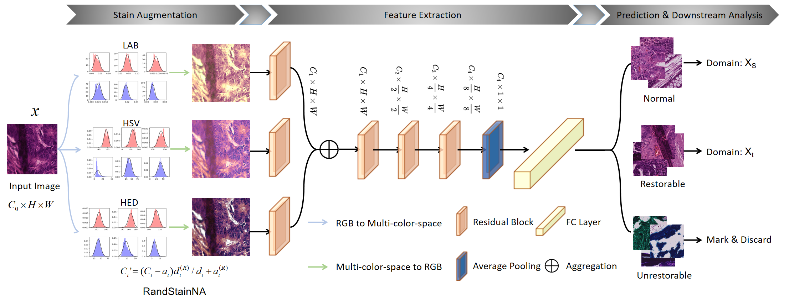
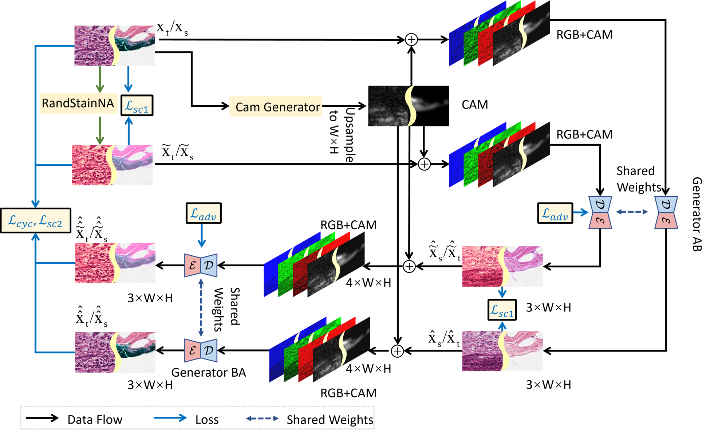
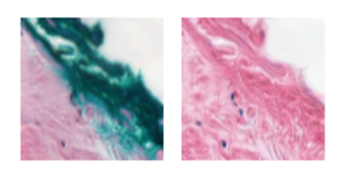

# AR-classifier-and-AR-CycleGAN

This repository contains PyTorch code for the paper: *Artifact Detection and Restoration in Histology Images with Stain-Style and Structural Preservation*

The artifacts in histology images may obstruct the accurate interpretation of medical information and cause misdiagnosis. In this paper, we proposed a new framework for artifacts detection, classification and removal. The framework can differentiate various artifacts, e.g., tissue folds, marking dye, tattoo pigment, and spot, from normal tissues and attempt a restoration depending on the recoverability. 

This repository contains two new models: AR-classifier and AR-CycleGAN. The AR-classifier is designed to classify artifacts, while the AR-CycleGAN is capable of artifact recovery. 

The AR-classifier is designed based on the ResNet18 architecture and is capable of classifying patches from whole slide images (WSIs) into three categories: "artifact," "normal," and "unrestorable."

The AR-Cyclegan is designed based on the CycleGAN and can remove artifacts from patches belonging to the "artifact" category.

## Datasets

We provide two download links here for the our artifacts classification and cyclegan dataset.

[OneDrive](https://sjtueducn-my.sharepoint.com/:f:/g/personal/yx_sun_sjtu_edu_cn/EmL-Ek6v-ElNp9E96AiDVe0B_N12Beca57UrW_R-qZohMw?e=dLBrbq)

[Baidu Cloud](https://pan.baidu.com/s/1Pbws5T46uHdAEAgiOFcH1A?pwd=dx6t)

---

The expriment images will be released soon.

